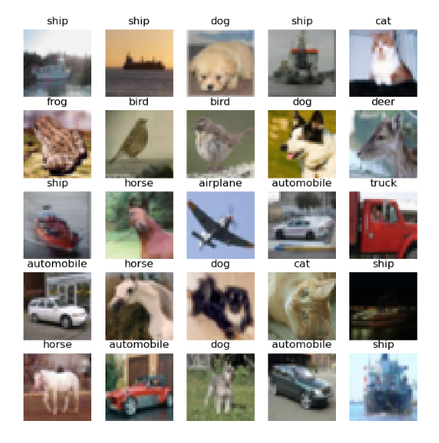

# CIFAR-10 Image Classification with PyTorch

这是一个基于 PyTorch 框架实现的图像分类项目，使用了 CIFAR-10 数据集。😊

## 目录

- [介绍](#介绍)
- [环境配置](#环境配置)
- [数据准备](#数据准备)
- [模型训练](#模型训练)
- [模型评估](#模型评估)
- [使用方法](#使用方法)
- [文件结构](#文件结构)
- [许可证](#许可证)

## 介绍
CIFAR-10 是一个常用的图像识别数据库，包含 60000 张 32x32 的彩色图片，分为 10 类，每类有 6000 张图片。
这个项目展示了如何使用 PyTorch 来构建并训练一个简单的卷积神经网络（CNN）来对这些图像进行分类。

<div style="text-align: center">
    
</div>


## 环境配置

为了运行本项目，请确保安装了以下依赖项：

```bash
pip install torch torchvision matplotlib tensorboard
```

## 数据准备
本项目直接使用 `torchvision.datasets` 来加载 CIFAR-10 数据集，无需额外的数据下载步骤。

## 模型训练
要开始训练模型，请执行如下命令：
```bash
python train.py --logdir=runs
```

参数说明：
- `--logdir`:Tesndorboard日志保存路径，默认为`runs`

## 模型评估

训练完成后，可以使用 evaluate.py 脚本来测试模型性能：

```bash
python evaluate.py --model_path=models/best_model.pth
```

参数说明：
- `--model_path`: 训练好的模型权重文件路径。


## 使用方法
1.克隆仓库到本地。  
2.根据“环境配置”部分安装必要的库。  
3.运行训练脚本：`python train.py`。  
4.查看 TensorBoard 结果：`tensorboard --logdir=runs`。  
5.使用训练好的模型进行预测：`python evaluate.py --model_path=models/best_model.pth`。

## 文件结构

```text
cifar10-classification/
│
├── data/                    # 数据存放目录
├── models/                  # 模型权重存放目录
├── runs/                    # TensorBoard 日志存放目录
├── train.py                 # 训练脚本
├── evaluate.py              # 评估脚本
├── model.py                 # 定义模型架构
└── README.md                # 项目说明文档
```
