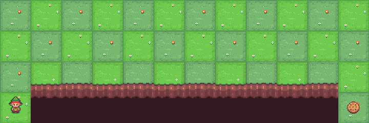

# QLearning with gym

## 介绍

这是一个基础的使用 Q-learning 算法在 gym 环境中的 cliff_walking 中实现的强化学习算法。

<div style="text-align: center">
    
</div>

## 环境配置
为了运行本项目，请确保安装了以下依赖项：
```
python-3.9.21
pytorch-2.2.2
gym-0.26.1
pygame-2.6.1
matplotlib-3.9.4
numpy-1.26.4
pandas-2.2.3
```

## 模型训练
```
python main.py
```

## 文件结构
```text
2_QLearning_gym_none/
│
├── assets/            # 资源文件夹
├── experiments/       # 实验结果
└── main.py/           # 训练脚本
```